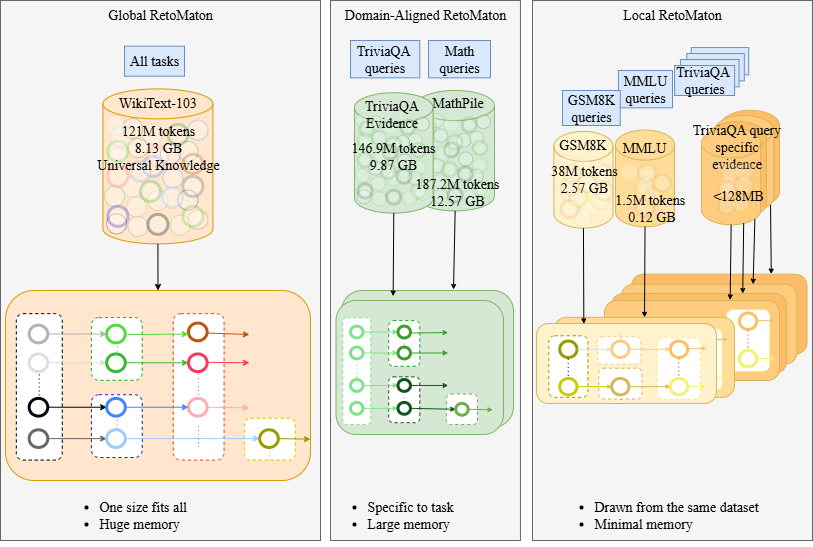
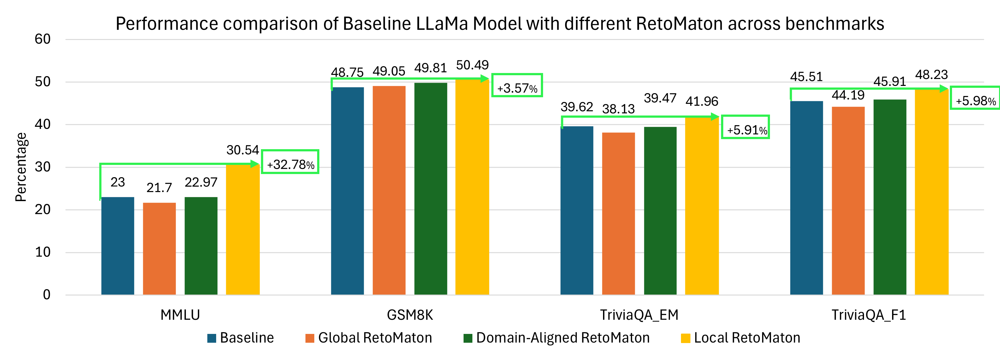

# Rethinking Reasoning in LLMs: Neuro-Symbolic Local RetoMaton Beyond ICL and CoT
| [Paper](https://arxiv.org/abs/2408.11815) |


## Table of Contents
  * [Background](#background)
  * [Quickstart](#quickstart)
    * [Step 1: Setup the Environment](#step-1-setup-environment)
    * [Step 2: Saving a datastore and building a Faiss Index](#step-2-saving-a-datastore-and-building-a-faiss-index)
    * [Step 3: Perform clustering to setup retoMaton](#step-3-perform-clustering-to-setup-retomaton)
  * [Evaluating Reasoning on the different benchmark with local RetoMaton](#evaluating-reasoning-on-the-different-benchmark-with-local-retomaton)
  * [Results](#results)
  * [Acknowledgement](#acknowledgement)
  * [Citation](#citation)

## Background

### kNN-LM
Retrieval-augmented inference methods such as kNN-LM (Khandelwal et al., 2019) improve language-model generalization by interpolating the base LM’s predictions with those from a non-parametric datastore of training examples. At test time, the model retrieves k nearest neighbors in embedding space and forms a probability distribution over their targets, modulated by a softmax temperature. This mechanism enhances factual grounding and adaptability without retraining, but it suffers from scalability and noise as datastore size and retrieval distance increase. For more details, see the [paper by Khandelwal et al., ICLR'2020](https://arxiv.org/pdf/1911.00172.pdf)

### RetoMaton

Building on this idea, RetoMaton (Alon et al., 2022) introduces a lightweight, architecture-agnostic neuro-symbolic extension of kNN-LM. It organizes the datastore as a Weighted Finite Automaton (WFA), where semantically related embeddings form states connected by learned transitions. This symbolic structure enables context-aware traversal across decoding steps, reducing redundant lookups and enforcing coherent memory access paths. For more details, see the [paper by Alon et al., ICML'2022](https://arxiv.org/pdf/2201.12431.pdf)

### Local RetoMaton
Local RetoMaton extends the original framework by uncovering its inherent traceability: each decoding step corresponds to a verifiable transition within a finite-state structure, allowing reasoning paths to be explicitly reconstructed. By restricting retrieval to locally reachable transitions, it enforces symbolic coherence and bounded memory behavior, enabling transparent inspection of how context influences generation. This structured retrieval not only improves efficiency and generalization but also enhances interpretability and reliability, offering state-level explainability rarely achievable in blackbox LLMs. For more details, see the [paper by Mamidala et al., NeSy'2025](https://arxiv.org/abs/2408.11815)

<center style="padding: 40px"></center>

## Quickstart

### Step 1: Setup Environment

#### Clone this repository:
```
git clone git@github.com:TKAI-LAB-Mali/NeuroSymbolicLM.git
cd NeuroSymbolicLM
```

Run:
```
conda env create -f neurocuda.yml -n neurocuda
```

### Step 2: Saving a datastore and building a Faiss Index

#### Models Used in the Experiment

- **Llama-2-7b**: [meta-llama/Llama-2-7b-hf](https://huggingface.co/meta-llama/Llama-2-7b-hf)

#### Datasets to setup local, global and domain aligned datastores and RetoMaton.
- `GSM8k`: [openai/gsm8k](https://huggingface.co/datasets/openai/gsm8k)
- `TriviaQA`: [mandarjoshi/trivia_qa](https://huggingface.co/datasets/mandarjoshi/trivia_qa)
- `MMLU`: [cais/mmlu](https://huggingface.co/datasets/cais/mmlu)
- `wiki`: [wentingzhao/knn-prompt-datastore](https://huggingface.co/datasets/wentingzhao/knn-prompt-datastore)
- `math`: [wentingzhao/math-textbooks](https://huggingface.co/datasets/wentingzhao/math-textbooks)


To save a datastore and build the Faiss index, run:
```
 MODEL=meta-llama/Llama-3.2-1B
 DSNAME=openai/gsm8k
 DSCONFIG=main

 python -u run_dstore.py --model_name_or_path ${MODEL} --dataset_name ${DSNAME} --dataset_config_name ${DSCONFIG} --do_eval --eval_subset validation --output_dir checkpoints/${MODEL} --dstore_dir checkpoints/${MODEL} --build_index
```


### Step 3: Perform clustering to setup retoMaton

To build the FAISS index yourself, run:

```
 MODEL=meta-llama/Llama-3.2-1B
 DSNAME=openai/gsm8k
 DSCONFIG=main
 python -u run_dstore.py --model_name_or_path ${MODEL} --dataset_name ${DSNAME} --dataset_config_name ${DSCONFIG} --output_dir checkpoints/${MODEL} --dstore_dir checkpoints/${MODEL}/${DSNAME} --cluster_dstore --dstore_size 1549636 --num_clusters 15000 --sample_size 150000

```

Optional clustering hyperparameters are `--num_clusters` (typically `1/100` or `1/200` of the datastore size) and `--sample_size`  (ideally as high as possible, but higher values consume more memory and take longer to run).

#### Download the built datastores and clusters
You can also directly access our built datastore and WFA clusters through the link: https://huggingface.co/datasets/Ritu27/LLamaDatastores

**Downloading datastores**

For example, to download the math datastore, run:
```
  git clone https://huggingface.co/datasets/Ritu27/LLamaDatastores
  cd math
  git lfs install
  git lfs pull
```

### Evaluating Reasoning on the different benchmark with local RetoMaton

To evaluate Local ReetoMaton on the test set, run:

```
 MODEL=meta-llama/Llama-3.2-1B
 DSNAME=openai/gsm8k
 DSCONFIG=main

 python -u run_pipeline.py --model_name_or_path ${MODEL} --dataset_name ${DSNAME} --prompt --dataset_config_name ${DSCONFIG} --eval_subset test --output_dir results/${MODEL}/${DSNAME} --dstore_dir checkpoints/${MODEL}/${DSNAME} --retomaton
```

Additional test-time tunable hyperparameters include `--lmbda1`, which controls the interpolation between the datastore and the base language model; `--k`, specifying the number of retrieved nearest neighbors; and `--knn_temp`, the softmax temperature used to convert the retrieved distances into a probability distribution.

## Results

<center style="padding: 40px"></center>

## Acknowledgement
- **knnlm Implementation**: The knnlm is implemented based on the code available at [Neuro-Symbolic Language Modeling with Automaton-augmented Retrieval](https://github.com/neulab/knn-transformers).
## Citation
If you find our work helpful, please use the following citations.

```
@article{mamidala2025rethinking,
  title={Rethinking Reasoning in LLMs: Neuro-Symbolic Local RetoMaton Beyond ICL and CoT},
  author={Mamidala, Rushitha Santhoshi and Chhabra, Anshuman and Mali, Ankur},
  journal={arXiv preprint arXiv:2508.19271},
  year={2025}
}
```